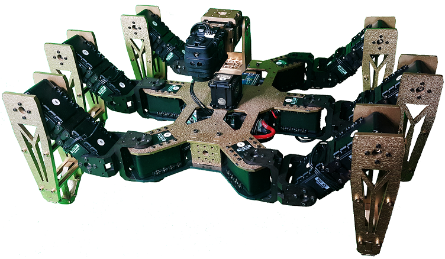

# SpiderBot

<br>

YouTube Video:

[](http://www.youtube.com/watch?v=tW0A7SIOCcE)
==========
   
   A hexapod spider robot that can be controlled by OpenCR, CM-700, OpenCM, or an Arduino with Robotis Shield. The robot is motorized by eighteen [Robotis Dynamixel AX-18A servos](http://support.robotis.com/en/product/dynamixel/ax_series/ax-18f.htm), and has one [Robotis AX-S1 integrated sensor](http://support.robotis.com/en/product/auxdevice/sensor/dxl_ax_s1.htm) mounted on a turret that is motorized by two [Robotis Dynamixel AX-18A servos](http://support.robotis.com/en/product/dynamixel/ax_series/ax-18f.htm) The robot frame is a slightly modified TrossenRobotics ABS PhantomX kit. 

# Repository Contents

* **/Docs** - Project Related documentations.
* **/RoboPlus Files** - Motion,Task, and Design Files generated using Robotis RoboPlus 1.x & 2.x
* **/Research Paper** - Related robotics research documents.

#Version History

* Version 1.0 (work in progress).

# SpiderBot VSCode

## Overview

This project is a firmware for a hexapod robot ("SpiderBot") using Dynamixel AX-18A servos. The code is designed for Arduino-compatible microcontrollers and provides modular control for legs, a sensor turret, and optional AX-S1 sensor modules.

<br>
<br>

## Features

- **Hexapod Leg Control:** Modular support for 6 legs, each with multiple degrees of freedom.
- **Dynamixel Servo Communication:** Uses DynamixelWorkbench for robust servo management.
- **Sensor Turret:** Pan/tilt turret control for sensors or cameras.
- **RC Controller Support:** Remote control via serial interface.
- **Gait Controller:** Multiple walking gaits and speed control.
- **AX-S1 Sensor Integration:** Read temperature, luminosity, and sound level; control onboard LED.

## Directory Structure

```
HexapodPlatformIO/
├── include/           # Header files (e.g., AXS1Sensor.h)
├── src/               # Source files (e.g., main.cpp, AXS1Sensor.cpp)
├── lib/               # Optional libraries
├── platformio.ini     # PlatformIO project configuration
└── README.md          # Project documentation
```

## Getting Started

### Prerequisites

- [PlatformIO](https://platformio.org/) installed (VS Code recommended)
- Supported Arduino-compatible board (e.g., Teensy, STM32, ESP32)
- Dynamixel servos and compatible power supply
- (Optional) AXS-1 sensor module

### Building and Uploading

1. Clone this repository:
    ```sh
    git clone <your-repo-url>
    cd HexapodPlatformIO
    ```

2. Open the project in VS Code with PlatformIO extension.

3. Connect your board via USB.

4. Build and upload the firmware:
    ```sh
    pio run --target upload
    ```

### Configuration

- Edit `Config.h` to set pin assignments, baud rates, and other hardware-specific parameters.

## Usage

- On startup, the robot initializes all modules and prints status messages to the serial monitor.
- The main loop demonstrates turret movement; you can expand this to add walking, sensor reading, or remote control.

## File Descriptions

- `src/main.cpp` - Main firmware entry point; initializes all modules and runs the main loop.
- `include/AXS1Sensor.h` / `src/AXS1Sensor.cpp` - Interface for the AX-S1 sensor module.
- `DynamixelController.*` - Handles low-level servo communication.
- `Hexapod.*`, `Leg.*` - Implements hexapod kinematics and leg control.
- `Turret.*` - Controls the pan/tilt sensor turret.
- `RCController.*` - Handles remote control input.
- `GaitController.*` - Manages walking gaits and timing.

## License

This project is provided for educational and research purposes. Please check individual source files for license details.

## Credits

- Uses [DynamixelWorkbench](http://emanual.robotis.com/docs/en/software/dynamixel/dynamixel_workbench/) library by ROBOTIS.
- Developed by Muthanna Alwahash (c) 2025
